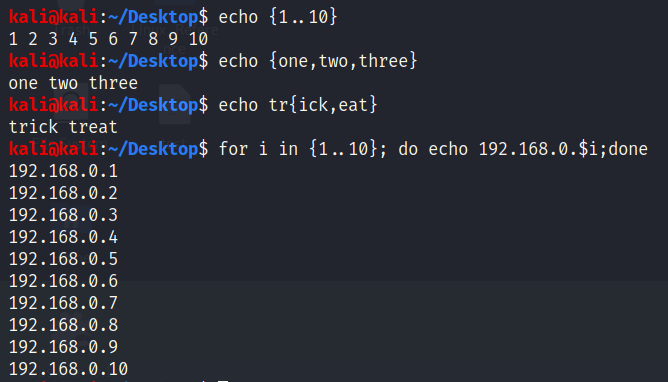
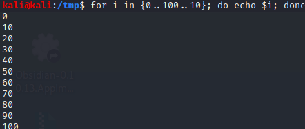
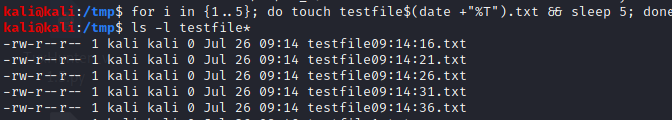
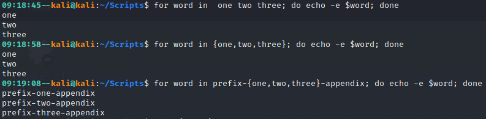
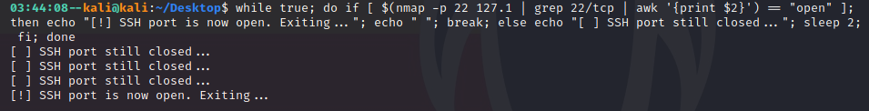
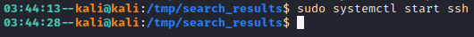

# Command Line-Fu
### **Brace Expansion**
Strings can be generated in sequence for use in naming files and directories, generating file contents, creating input to pass along in a pipeline, and scripting. To utilize brace expansion, enter either a comma-separated list of strings or range (separated by two dots, "..") of numbers between a pair of curly brackets. Optionally, a preamble and post-script can be placed before and after the brackets, respectively, to add a static portion to the output.

In the example below, brace expansion is used to insert an integer range (from 1 to 10) into a for loop to develop a list of IP addresses with the same first three octets.

 

<figure>
	
	<figcaption>Brace Expansion Examples</figcaption>
</figure>

 

When using a range in for brace expansion, a third parameter can be added, which acts as a specified increment, as shown in the example below.

 

<figure>
	
	<figcaption>Range Increment Example</figcaption>
</figure>

 

### **Command Substitution**
When using the Linux command line to parse through data, gather artifacts, or organize files, it may be more efficient to utlize command substitution to pass output from one command to another in a way that's not possible with the pipeline. 

In the example below, command substitution is used to run the `date` command inside the naming of a file to get the current time (in HH:MM:SS format) and use it in the filename. For demonstration purposes, this example was run within a for loop, however, in reality it wouldbe more useful within a recurring command (ie. cron job) to create a unique filename.

 

<figure>
	
	<figcaption>Command Substitution Example</figcaption>
</figure>

 

 

### **History Substitution / Event Designators**
Below is a short (not all-inclusive) list of useful shorthand ways to reference bash history and utlize all or part of commands previously used. This is not only useful for saving time on the command line, but for example avoiding typos when referencing long filepaths, or trying to recall the exact syntax of a previously run command, expecially if it involves a long pipeline or command substitution.
 
 

`!!` previous command, most commonly used to re-enter a command that error'ed out due  to lack of privileges (ie. ***sudo !!***)
`!$` last argument from previous command
`!#` item # from bash history
`!-#` item # lines back from most recent in bash history
`$$` the current bash process's PID
`!<string>` searches for the most recent command ***starting*** with "string" and executes it
`!?<string>` searches for the most recent command ***containing*** "string" and executes it
`^<command1>^<command2>^` searches for the most recent command starting with "command1", replaces it with "command2", and executes it; "command1" and "command2" can include switches

 

In most instances of Bash, **ctrl+r** will initiate a search through the command history, where you can begin typing and match on any part of a previous command. This functionality will match on the most recent command first; to continue searching you can add text to refine the search, or press **ctrl+r** again to cycle back to the next matching command. If you cycle back too far and wish to search forward through commands, press **ctrl+s**. 

**NOTE:** In some instances of bash, **ctrl+s** will suspend the current terminal, if this happens, **ctrl+q** will resume the terminal.

If you begin to type a complex command, then wish to search the history since you know it's been used before, enter **ctrl+aryr**, which corresponds to the following actions:
- **ctrl+a**: moves cursor to the beginning of the line (same functionality of **home** in this case)
- **ctrl+r**: call reverse bash history search, copies text typed thus far
- **ctrl+y**: paste copied text back onto command line
- **ctrl+r**: move to most recent matching command in bash history

 

### **<u>Loops</u>**

Loops in any programming language are useful to repeat a task or tasks for a given number of times or until conditions are met. For simple tasks like creating a target list of IP addresses for example, a for loop "one-liner" can be crafted and run in the terminal. Examples of useful "one-liners" will be listed below with a brief explanation.

#### **For Loops**
The basic layout of a one-line for loop is as follows:
- `for variable in range,counter,dataset; do command1; command2; command3; done`

Ranges are the simplest way to complete tasks or commands for a given number of times (ie. 1..10 to count from 1 to 10, or 1..10..2 to count by 2 from 1 to 10). Ranges need to be enclosed in braces to be expanded out, hence brace expansion. 

The following example creates a target list of all IP addresses in the 192.168.0.0/24 network, excluding the standard gateway and broadcast addresses: 
- `for i in {2..254}; do echo 192.168.0.$i >> target.list; done`

Counters are similar to for loops in that they can start at a designated number and increment by a designated value until they reach a limit, the main difference is in the formatting. Counters are wrapped in double parentheses, and contain the following three semi-colon-separated expressions: the initial value of a variable, the variable value at which the loop will break, and the value to increment by in each iteration. The following example would create the same target list as the range example:
- `for (( i=2; i<=254; i++ )); do echo 192.168.0.$i >> target.list; done`

Datasets can be used to iterate over a group of strings adn perform some action with them. The "dataset" can just be a number of strings in sequence separated by spaces, or can utilize brace expansion to allow the addition of an optional prefix or appendix, as displayed in the example below.

 

<figure>
	
	<figcaption>For Loop Examples</figcaption>
</figure>

 

Additionally, datasets can consist of files in a directory that you want to perform some action on. It may seem overvly complex to loop through each file to perform and action on it, such as `grep` for content, but looping through provides the ability to format output, and in the event of a large amount of matches append the matches to output files organized by their source.

For example, the following command loops through all files in the /var/log directory (standard location for OS and service log files) and searches for "test", which could be replaced by an IP address or other string of interest. While stdout and stderr are suppressed with `&>/dev/null` , grep will still return an exit code of "0" upon matching, which is used in the if statement to check for matches. If there is a match, formatted output displaying the match is appended to a newly created file named after the matched file, with a prefix of "SEARCH--".

- `for file in /var/log/*; do grep test $file &>/dev/null; if [ $? == 0 ]; then echo -e "Matching Content $(grep test $file 2>/dev/null)" >> ./SEARCH--$(echo $file | awk -F/ '{print $NF}'); fi; done`

With a small amount of data to go through, this much effort is unnecessary. However, if attempting - from the host artifact side - to identify something like port scanning or brute forcing, a for loop "one-liner" like this could be used to corellate and organize data about a single external entity attempting to access multiple services on a host.

#### **While / Until Loops**
While and Until loops in Bash are most useful when a certain task or tasks need to run indefinitely until a certain condition is true (until) or no longer true (while). The basic syntax is as follows:
- `while condition; do command1; command2; command3; done` - this will test for a condition, and execute command1-3 if the condition is true, then check the condition again and repeat until it is no longer true.
- `until condition; do command1; command2; command3; done` - this will test for a condition, and execute command1-3 if the condition is false, then check the condition again and repeat until it is true.

While and Until loops can be used in a similar way to one-line for loops to repeat a command a certain number of times, albeit in a slightly more complex way, like in the following example:
- `i=1; while (( $i < 10 )); do echo "Iteration #$i"; (( i++ )); sleep 1; done`

Where While and Until loops become particularly useful is in a situation that requires an infinite loop that will be either manually cancelled through a keyboard interrupt, or when a very specific condition is met. One very niche use case would be automating a port scan of a specific port on a remote host to check when the port opens up / the service is started, like in the following example.
- `while true; do if [ $(nmap -p 22 127.1 | grep 22/tcp | awk '{print $2}') == "open" ]; then echo "[!] SSH port is now open. Exiting..."; echo " "; break; else echo "[ ] SSH port still closed..."; sleep 2; fi; done`

The example below shows the above command in use, note the time stamps on the prompt after the commands are executed. The while loop (first image) is executed after 03:44:08 and stops at 03:44:28, which is the same time on the prompt following the execution of `sudo systemctl start ssh` in the second image.

 

<figure>
	
	<figcaption>While Loop Single-Port Scan</figcaption>
</figure>

 

<figure>
	
	<figcaption>Starting SSH Service</figcaption>
</figure>

 

It should go without saying that loops are even more useful within scripts, but these examples should prove that loops can be force multipliers for other utilities in bash, and enable automation on the fly once the basic syntax is understood.

 

### **Standard Hotkeys**
ctrl + x and Ctrl + e - take current command line content (before execution), load into editor to create a script

 

### **Useful Examples**

Ping Sweep - 
`{ for i in {1..254}; do ping -c 1 -W 1 192.168.88.$i & done } | grep "64 bytes"`

Display current bash key bindings (hotkeys) - 
`bind -P | grep -v "not bound to any keys"`

**External References:**
- https://www.gnu.org/software/bash/manual/html_node/Pipelines.html
- https://www.commandlinefu.com/commands/browse/sort-by-votes
- https://www.thegeekstuff.com/2011/08/bash-history-expansion/
- https://www.digitalocean.com/community/tutorials/how-to-use-bash-history-commands-and-expansions-on-a-linux-vps
- https://www.shell-tips.com/bash/loops/
