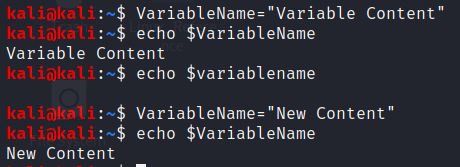
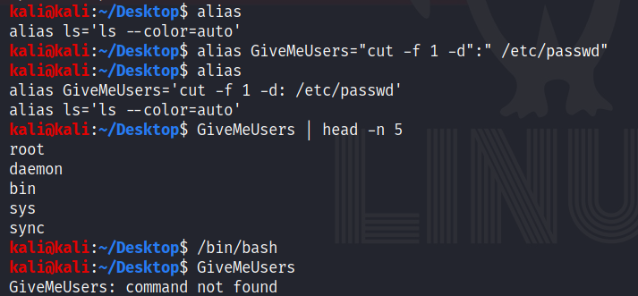

# **Linux and Bash Basics**

#### **MAN Pages and Help Files**
Manual pages, also known as man pages, are simply reference manuals, most commonly used to understand the functionality of any given command. There are different categories that man pages fall into, depicted in the table below. 
 
Man pages can be accessed by typing <code> man ***command*** </code> , which will open them with the ***less*** manual pager. Additionally, most commands also have abbreviated help files that can be accessed by typing <code> ***command*** -h </code> **OR** <code> ***command*** --help </code> . 
 

**NOTE:** Since manual pages are opened with ***less***, you can initiate a test search by typing "/", as well as utilize any other functionality that ***less*** possesses. 

 

|Manual Page Number   | Description
|----------------|-----------------------------------------------------------------------|
| 1   					  | Executable programs or shell commands    											 |
| 2   					  | System calls (functions provided by the kernel)   									|
| 3                       | Library calls (functions within program libraries)    								  |
| 4                       | Special files (usually found in /dev)   													  |
| 5                       | File formats and conventions, e.g. /etc/passwd   								   |
| 6                       | Games   																									 |
| 7                       | Miscellaneous (including macro packages and conventions)		        |
| 8   					  | System administration commands (usually only for root)   					|
| 9   					  | Kernel routines (Non standard)																  |

 

### **FS navigation / operation**
- <code>pwd</code> displays the present working directory
- <code>cd</code> change directory
- <code>ls</code> list contents of a directory
- <code>touch</code> create a file; update timestamp
- <code>mkdir</code> make a directory
- <code>rmdir</code> remove directory
- <code>chmod</code> change permissions
- <code>chown</code> change ownership
- <code>cp</code> copy files
- <code>mv</code> move or rename a file
- <code>more</code> page through the contents of a file
- <code>less</code> page through the contents of a file (like more, but with more functionality)
- <code>cat</code> output the contents of a file
- <code>head</code> display the beginning of a file (10 lines by default)
- <code>tail</code> display the end of a file (10 lines by default)
- <code>wc</code> count lines, characters, or bytes of a file
- <code>gpg</code> encrypt a file 
- <code>sha#sum / md#sum</code> hash a file or data
- <code>dd</code> dump data from various sources (hard drive, partition, process memory)

 

### **System Survey**
- <code>fdisk</code> disk partitioning functions
- <code>free</code> display memory usage statistics
- <code>dmesg</code> prints the kernel message buffer, including device driver messages
- <code>uname</code> retrieve general system information (kernel version, architechture, os, etc.)
- <code>lshw</code> display hardware devices
- <code>lscpu</code> display cpu information
- <code>lsblk</code> display block devices (hard drives / partitions, mountpoints, usb devices, etc.)
- <code>lsusb</code> display currently available usb devices
- <code>df</code> display free / used space on the filesystem

 

### **Common Redirection**
- <code>></code> sending standard output to ***overwrite*** a designated file
- <code>>></code> sending standard output to ***append to*** a designated file
- <code>&lt;</code> retrieve contents from a file or source, send to standard input
- <code>2>/dev/null</code> suppress errors 

 
	
### **Process / Service Info Retrieval**
- <code>ps</code> list processes
- <code>pidof / pgrep</code> retrieve the pid of a process(es)
- <code>systemctl / service</code> retrieve service information (systemd)
- <code>top / htop</code> displays processes and their associated resource utilization in live output. **NOTE:** Due to the live output, top and htop are not recommended for incorporation into scripts.
- <code>pstree</code> displays processes in a parent-child relational format
- <code>kill</code> send termination signal to a process by PID
- <code>pkill</code> send termination signal to a process by process name
- <code>killall</code> send a termination signal to all processes with a specific process name
- <code>pstree</code> displays processes in a parent-child relational format

 

()[images/LinuxKillProc.jpg]

 

### **Network Information Retrieval**
- <code>ip / ifconfig</code> display information about network interfaces
- <code>netstat / ss</code> display current connection information
- <code>lsof</code> list open files associated with processes / network connections

 

### **User Information**
- <code>who / w</code> displays currently logged in users
- <code>last</code> display successful login / logout events as recorded in /var/log/wtmp
- <code>lastb</code> displays unsuccessful login events recorded in /var/log/btmp 
- <code>id</code> simple command line utility for displaying a real and effective user and group IDs
- <code>groups</code> used to show all the groups a user belongs to
- <code>finger</code> used to search information about a user (ie. real name, home directory, default shell, time logged in, etc., as applicable). **NOTE:** Not installed by default on all linux distros.
- <code>lslogins</code> displays information about user accounts on the system such as UID, username, number of owned running processes, last login time, and user [GECOS](https://en.wikipedia.org/wiki/Gecos_field) field
- <code>users</code> displays users currently logged in to the system
- <code>who</code> displays users currently logged in to the system, the terminal they are connected to, last login date/time, and the address they are connected from ( "(:0)" for locally logged-in, or an IP address for a remote connection)
- <code>w</code> displays system uptime, number of users logged in, and basic information about their login session (ie. username, terminal, address connected from, login time, etc.)

 

### **Variables**

 

Local Variables in bash can be assigned by typing the "naked" variable name on the left side of an equals sign, and the assigned value on the right.  The variable can later be recalled by prepending a "$" to the variable name (ie. a=b, and the variable is later recalled by typing $a) from within the current terminal / context only. Variable names are case sensitive, as with most things in Linux.

 

<figure>
	
	<figcaption>Local Variable Creation and Use</figcaption>
</figure>

 

Environment Variables can be declared by prepending "export" to a normal variable declaration (ie. export a=b). This will allow the variable to be used by the current terminal / context, as well as any children spawned.

Global Variables are ones declared at the beginning of a bash script that can be used throughout in various functions or commands, unless over-written.

Lastly, bash has standard environment variables that can be queried for information and / or manipulated to affect attributes of a user's shell experience. They can be found [here](https://www.gnu.org/software/bash/manual/html_node/Bash-Variables.html).

 

### **Aliases**

 

When typed with no arguments, the ***alias*** command will display current aliases. To set a new alias, type <code> alias shortname=command </code>, where shortname is the alias you want to type / run, and command is the the action you want to perform. Aliases will only be available in the current terminal / context.

 

<figure>
	
	<figcaption>Alias Display, Creation, and Use</figcaption>
</figure>

 

To make an alias permanent for a user account, it can be either added to the **~/.bashrc** file for that user, or a separate file such as **~/.bash_aliases** with a reference to said file in the **~/.bashrc** file.

 

### **ID'ing installed software**
Use the following commands to Identify installed packages on a \*NIX distribution. 

- Aptitude-based distributions (Ubuntu, Debian, etc): <code>dpkg -l</code>
- RPM-based distributions (Fedora, RHEL, etc): <code>rpm -qa</code>
- pkg*-based distributions (OpenBSD, FreeBSD, etc): <code>pkg_info</code>
- Portage-based distributions (Gentoo, etc): <code>equery list</code> or <code>eix -I</code>
- pacman-based distributions (Arch Linux, etc): <code>pacman -Q</code>

**NOTE:** Additional programs can easily exist elsewhere (typically within a users $PATH) without being identified as installed packages by the above commands, especially if they were manually installed / compiled on the system.
	
 

### **Content Search / Output Manipulation**
The commands below, while still useful on their own, are most powerful combined together in pipeline command, where they can extract and draw attention to important information, provided the appropriate logic behind them. Useful examples of this are covered in a separate section, [CLI-Fu](CLI-Fu.md).

- <code>grep</code> search file / output content by keyword
- <code>egrep</code> search file / output content by regular expression (same as grep -e)
- <code>awk</code> retrieve specified ***columns*** from files / output 
- <code>sed</code> edit data as a stream, will only change the first occurrence per line by default
- <code>tr</code> translate or delete characters, replace from one set with another
- <code>cut</code> select specific "fields" from lines of input data to print, uses **tab** as the default delimiter, but any can be specified
- <code>sort</code> sort lines of data by the first character, assumes ASCII content by default
- <code>uniq</code> remove duplicate **sequential** lines of data

 

**References:**
- https://phoenixnap.com/kb/linux-commands-cheat-sheet
- https://www.tecmint.com/find-user-account-info-and-login-details-in-linux/
- https://www.gnu.org/software/bash/manual/html_node/index.html
- https://www.gnu.org/software/bash/manual/bash.html
- https://www.geeksforgeeks.org/tr-command-in-unix-linux-with-examples/
