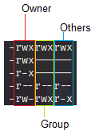
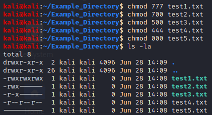
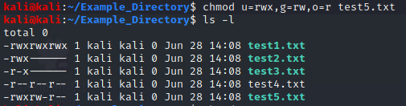
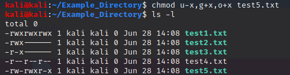
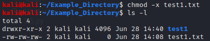
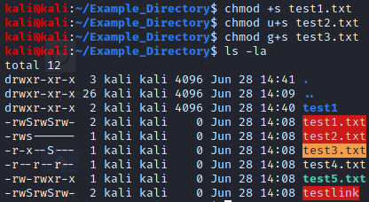
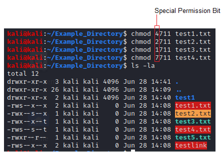

# File Permissions

## Contents:
- [Categories](#categories)
- [Permissions](#permissions)
- [Special Permissions](#special-permissions)
- [External References](#external-references)

## **Categories**
Permissions are broken into three categories in terms of who they apply to:
- **Owner** (creating user by default)
- **Group** (group the owner belongs to)
- **others** (other users)

 

## **Permissions**
Each of the above categories can contain any combination of the following permissions, which can be represented by the associated numerical value:
- **Read(4)**
- **Write(2)**
- **Execute(1)**

 

The permissions for a given file or directory are displayed on the far left (by default) of a long listing. 

 

  

Permissions can be edited explicitly or relatively using the ***chmod*** command.

- **Explicit examples:**

 

 

 

- **Relative examples:**

 

 

 

## **Special Permissions**
Linux files can also contain the following special permissions:
- **SetUID (4)**: Tells the system to execute a file with the owner's permissions. 
- **SetGID (2)**: Tells the system to execute a file with the group's permissions.
- **Sticky bit (1)**: Only the file owner can rename or delete the file.

 

Both the SetUID and SetGID permissions are set with the "s" permission for either the user or group, respectively. Additionally, both can be added simultaneously by not specifying the "u" or "g" option.

 

 

The Sticky bit is set with the "t" permission, and appears in the "other" section of the permissions.

 

**NOTE:** If the execute bit underlying the special permission is set, the special permission ("s" or "t") will appear as a capital, and vice versa if it is not set.

  

Special permissions can also be set by pre-pending their numerical value to the three-digit explicit permissions. 

 

 

### **External References:**
- https://www.linux.com/training-tutorials/understanding-linux-file-permissions/
- https://phoenixnap.com/kb/linux-file-permissions
