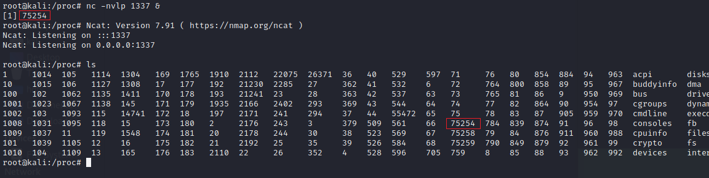
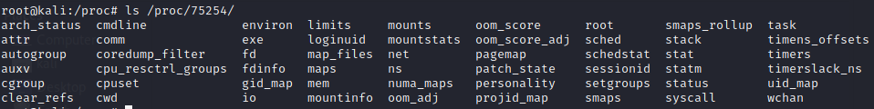
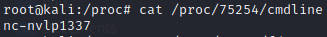

# The Virtual Filesystem (/proc)
## Contents:
- [Overview](#overview)
- [Process Info](#process-information)
- [System Info](#system-information)
- [External References](#external-references)

## **Overview**
As stated in the [Standard Directories](standard_dirs.md) section, the /proc directory contains special files that do not exist on the physical filesystem. The entire directory is created at boot, the special files therein contain information about the system as it is currently running, and the filesystem disappears when the system is shutdown or rebooted. The contents of the directory generally fall in one of two categories:
- Process Info (organized into directories named by PID)
- System Info (virtual files/subdirectories that can be queried for info)

 

## **Process Information**
Every running process will have a subdirectory within ***/proc***, identified by its Process ID (PID). Within that subdirectory, information about that running process is stored, someof the most important of which are, but not limited to:
- cmdline: the command line arguments with which the process was started
- exe: the executable on disk from which the process was spawned
- cwd: current working directory for the process
- maps: memory address space mapping for the process

 

 
*Pictured Above: A netcat listener was started in the background with the PID 75254, which then shows up as a subdirectory within **/proc**.*

 

 
*Pictured Above: The contents of a process (netcat in this case) subdirectory.*

 

 
*Pictured Above: The contents of the netcat process **cmdline** file, which matches the command line arguments it was started with.*

 

## **System Information**
The additional special files in /proc not related to specific processes contain various system information. These special files are often leveraged by native commands one would use to gather system information, the output is just usually formatted to make it more readable. Examples include, but are not limited to:
- uptime: time since boot (***uptime***)
- version: kernel info (***uname***)
- mounts: mounted filesystem(s) info (***mount***)
- cpuinfo (***lscpu***)

 

The use of items within ***/proc*** will be covered in more depth in the [Memory Forensics](mem-forensics.md) section.

 

## **External References:**
- https://www.linux.com/news/discover-possibilities-proc-directory/
- https://stackoverflow.com/questions/1401359/understanding-linux-proc-id-maps
- https://serverfault.com/questions/173999/dump-a-linux-processs-memory-to-file
